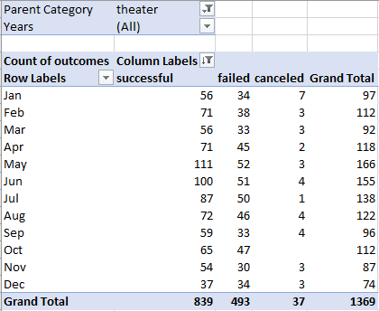
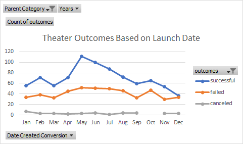
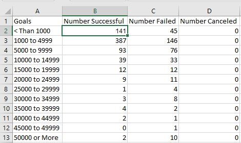
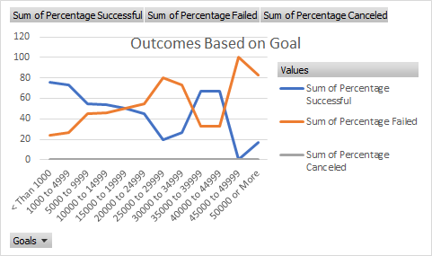

# **Theater Campaign Outcomes by Launch Date and Outcomes Based on Goals**
## **Overview**
	After having an almost successful funding campaign for her play *Fever*, Lousie wants to know how launch dates and funding goals affect the outcome of theater campaigns.
## **Purpose**
 	The purpose of this analysis is to determine how theater campaigns are affected by launch date and the outcome of funding goals depending on their range. In order to do this, I will be utilizing pivot tables, line charts as well as the countifs, sum, and round functions to provide a breakdown and visual comparison of the data.
## **Analysis of Outcomes Based on Launch Date**
### Using A Pivot Table to Summarize Theater Outcomes by Launch Date
To summarize how a theater campaign performed by its launch date, a pivot table was used to filter the Parent Category to theater only and Years 2009 to 2016. To see the number of successful, failed, and canceled campaigns, outcomes was placed in the values field as well as the columns field and sorted in descending order to show successful outcomes first then failed and lastly, canceled. Finally, Date Created Conversion was entered in the rows field to separate the outcomes by months of the year. 
 
 

## Using a Line Chart for a Visual Comparison of Theater Outcomes by Launch Date
A line chart was used to provide a visual comparison of the percentages of successful, failed and canceled theater campaigns by month. By placing the percentage of successful, failed, and canceled in the values field and the goals in the axis field we can see how which months were more successful and which months had a higher fail rate. 
 
 
 
##**Analysis of Outcomes Based on Goals**
### Countifs Function to get the Number of Outcomes by Goal Range
The countifs function was used to get the count of successful, failed, and canceled outcomes by their goal range. For example, to see the number of successful plays for the goal range of 1000 to 4999, the countifs function used was,  
 -The first criteria, =Countifs(Kickstarter!F:F,”=successful” pulls the all the successful outcomes from column F in the Kickstarter spreadsheet. 
 -Next, to get the number of goal amounts that fall between 1000 to 4999 from column D in the kickstarter spreadsheet, the second criteria entered was  	   “Kickstarter!D:D,”>=1000”Kickstarter!D:D,”<4999”. 
 -Finally, to get the number of plays only from the Subcategory column R, the last criteria entered was, Kickstarter!R:R,”plays”. This process was repeated to obtain the number of Failed and Canceled outcomes as shown below. 
 
 
 
### Sum Function to get Totals of Successful, Failed, and Canceled Plays by Goal Range
The sum function was used to get the total number of goal ranges for all three categories, successful, failed and canceled. For example, to get the total number of successful, failed, and canceled projects for the goal range 15000 to 19999, in the Total Projects column E, we enter the sum function =SUM(B6:D6) which gives us 24. It is important to get the Total Projects for all outcomes in order to be able to get the percentage of each outcome in the following step. 
 
  
 
### Round Function to get the Percentage of Successful, Failed, and Canceled Outcomes by Goal Range
Finally, to get the percentage of each goal range, we utilize the round function. To get the Percentage of Successful outcomes for the goal range 4000 to 44999 we use the function =Round(B11/E11*100,0). This takes the number of Successful outcomes from cell B11 which is 2 and divides it by the number of Total Projects in cell E11,3, which comes out to .66 and is then multiplied by 100 to get a whole number, 66.66 and it is rounded up to 67 and the 0 indicates no numbers after the decimal point.   

### Using a Pivot Table to Summarize Percentages of Successful, Failed, and Canceled Outcomes
	In order to summarize outcomes by range, Percentage Successful, Percentage Failed, and Percentage Canceled are placed in the Values field, Goals is placed in the Rows field. 
**Challenge**	I had to use the less than symbol for the goal range *Less than 1000* because with the wording was causing it to move below 45000 to 49999. This was also affecting the Line Chart. 
 

### Using a Line Chart to Compare Successful, Failed, and Canceled Outcomes by Goal Range
	To get a visual comparison of how outcomes perform based on goal range, Goals is placed in the Axis field and Percentage Successful, Percentage Failed, and Percentage Canceled are placed in the Values field. The line chart does not give an accurate depiction of which goal ranges are more successful or which failed because we do not see the individual number of each outcome. 
 
 
 
## **Results**
### Theater Outcomes by Launch Date
	The best months of year to launch a theater campaign is May and June, with May having 111 Successful outcomes and June having 100. This seems to be consistent from years 2012 to 2016. 
The number of Failed outcomes is also higher in May and June; however, only by half. Overall, the total number of failed outcomes,493, is still less than the successful outcomes, 893 and the number of canceled is minimal at 37. 
### Outcomes Based on Goals
	The most successful campaigns had a funding goal range of 1000 to 4999, the total number for successful outcomes is 387 and a 73% success rate out of the 186 total projects. The funding goal with the highest percentage is the Less than 1000 range. This is probably because funding goals for Less Than 1000 had a lesser number of total projects but still a higher success outcome of 141 out of 186. Cancellations is still not a major factor in the outcome of a theater campaign. It should also be noted that some higher goal ranges have a higher percentage of success, but the number of total projects are lower in those ranges.  
### Limitations
 	To Further look at how successful a theater campaign will be, we could break down the Country Category to a subcategory of US states or US regions, this is assuming Louise is in the states. Since she came close to her funding goal, the area where she is located could also have had an impact on the outcome. A pivot table could have been used compare how well theater campaigns perform by state/region. By filtering by subcategory plays and if there was a states/region column, that would be placed in the Rows field and then outcomes in the Columns and Values field. This could show where theater campaigns are more successful.
